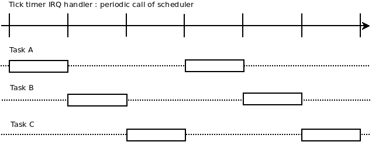
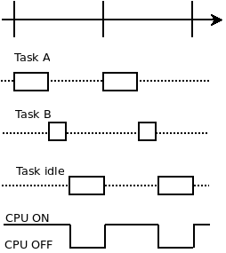

# MultiTasking support

The firmware implements a simple multi-tasking support thanks to a basic preemptive scheduler. It supports the registration of a list of task before launching the scheduler, but the addition of task dynamically while it has been started is not supported.

The scheduler is clocked using a timer of the MCU at a fixed rate which can be configured at machine startup (currently 5, 10 or 20 ms).

Relevant sources files are ```core/sched.c``` for the time related functions and ```core/kos.c``` for the tasks managements & contexts switchs.

## Goals & motivations

## Context switchs

Handling simple multi-tasking consists to enable a framework that can store & restore context of all the different tasks. This context is composed of all the history of execution of a particular task (the task _stack_), and the CPU registers.

Thus, the OS implements a management of the list of tasks to reference them, and it also handle a list of _stack_ with a dedicated allocated memory area for each task.

Periodically when the _tick_ timer overflow, the corresponding IRQ handler can do a context switch if required. It consists to save all the registers of the CPU on the stack, and then update the stack pointer register to refer to the newly selected task. When the IRQ handler exits, the CPU will then continue the execution of another task.

## Preemptive scheduling policy

When tasks are created and handled by the scheduler, they will gain by default 100% of CPU time on each time period (or timeslot) between ticks. In figure below, we can see and example of three concurrent tasks A, B and C, scheduled each time the tick handler is trigged.



We can see the tasks are preempted, unless they explicitely defined an atomic block or if they have disable interruptions in criticals sections. In these cases, the scheduling handler will occur just after the interrupts are enable again.

The scheduler apply a _round-robin_ policy while selecting the next task to run.

## Cooperative scheduling and idle task

While tasks are running, they can explicitly relax their CPU time. In that case, the scheduling is called cooperative, meaning the task explicitly schedule another task. When it happen, the tasks is considered inactive or sleeping until the next tick event.

During a timeslot, if all tasks relaxs the CPU the OS will give CPU time to a specific tasks : the _idle task_. This task is in charge of putting the CPU in sleep mode to perform a basic power saving feature.



## Tasks states

Tasks can have multiples states:

* READY
* SLEEPING
* ZOMBIE

When a task is READY, it means it is selectable by the scheduler to gain CPU time (it can be the current running task as well).

A task in WAITING state is sleeping for at least a dedicated amount of "ticks". This can be one tick when cooperative scheduling has been asked, or multiples ticks if task had asked to sleep for a given delay.

A task in ZOMBIE state had exited, and will not be scheduled anymore.

# Tasks API

## Minimal task function

Here below is an example of the minimum task source code. 

```C
void task_A(void)
{
    for(;;) {
        /* tasks instructions here */
    }

    /* note: we must not return from this function */
}
```

You should note that a task function should never return, as the dedicated task stack starts on this function.

## Task registration and task stack

To register this task to the OS, the following code is required before the scheduler is started :

```C
void main(void)
{
    uint8_t * stack_A = malloc(256);
    
    kos_init();
    
    kos_new_task(task_A, "TSK_A", stack_A, 256);
}
```

You should note the reserved amount of memory to the thread stack is fixed at registration (256 bytes in our example).

This may not be sufficient while development is on going. To avoid putting huge amount of memory for each tasks, the OS implements a feature which check at runtime if a task stack had not overflow.

In the case of this occur, the OS stops and a backtrace will be displayed on console to give stack usage details and task informations to trace which stack needs more space.

This feature is available when CONFIG_KOS_CHECK_STACKS is enabled.

## Cooperative scheduling

Here below is an example of cooperative scheduling call from a task:

```C
void task_B(void)
{
    for(;;) {
        /* tasks instructions here*/
        
        /* relax CPU */
        kos_yield();
    }
}
```


## Task exit

Here below is an example of task which required to exit:

```C
void task_C(void)
{
    int i;

    for(i = 0; i < 10; i++) {
        /* tasks instructions */
        printf("%d\n", i);

        kos_yield();
    }

    /* task will not be scheduled anymore */
    kos_task_exit();
}
```
